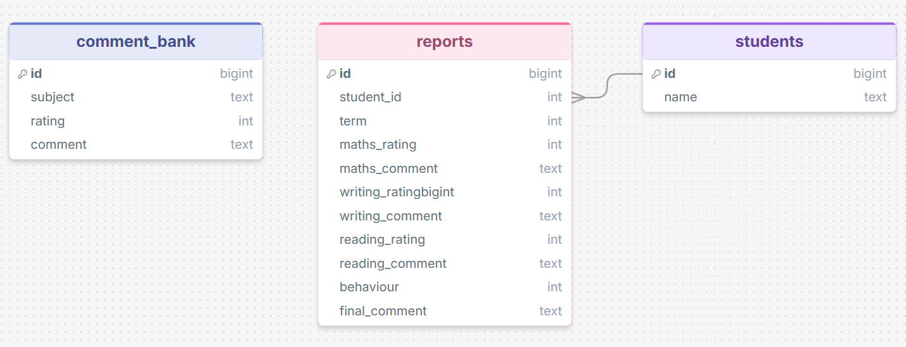
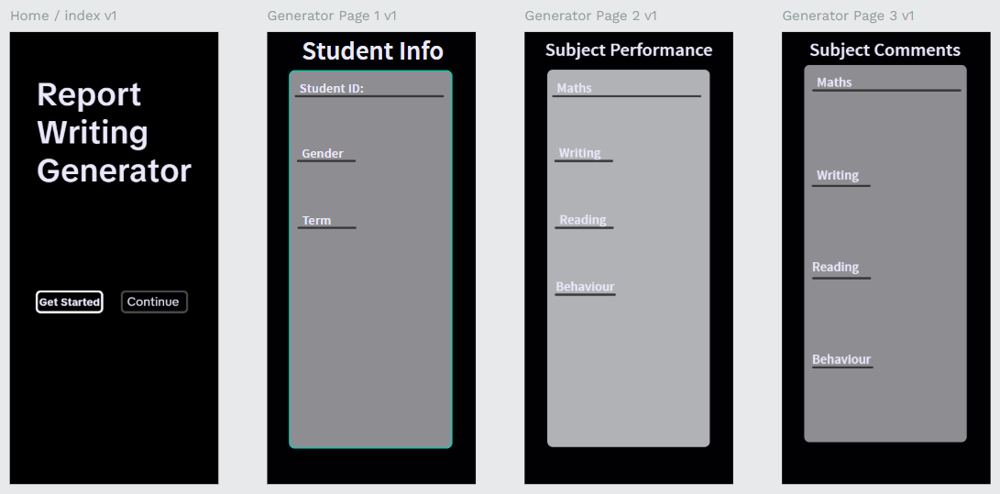
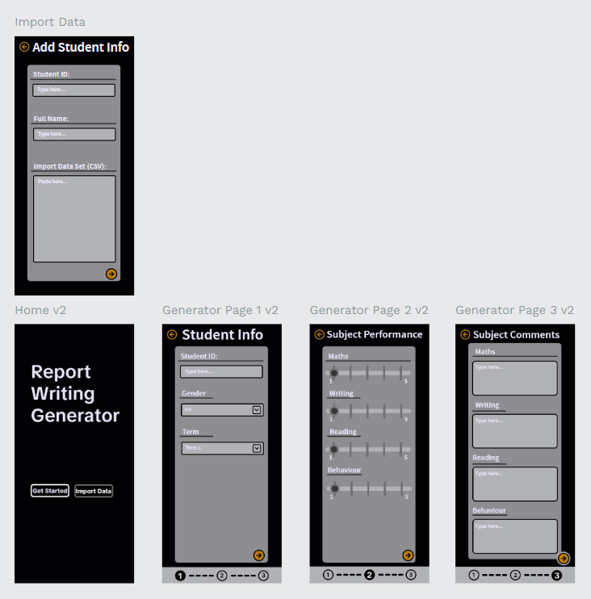

# Sprint 1 - Developing a DB and UI Prototype

## Sprint Goals

Develop a design for the database and a UI prototype that simulates the key functionality of the system. Test and refine the UI so that it can serve as the model for the next phase of development in Sprint 2.

### Specific Goals

**Edit these goals as needed**

- Design the database:
    - Tables
    - Fields / types
    - Primary keys
    - Default / nullable values
    - Relationships (foreign keys)
- Design the UI
    - Key pages
    - User interactions and 'flow'
    - Page layouts / features
    - Colour palette
    - Etc.

Questions for stakeholder:

*How does the report writing process work? Will it be a tick box questionare for each subject then a comment? What actually is the structure?*

Response: Dad - "Very specific indicators that the students performance is measured against, within that in each subject there are specific achievement objectives, such as do they know their 2, 3, 4, 5, 6, and 10 times tables."

How does each of the five achievement comments corrispond to a subject? (emerging, developing, consolidating, proficient and exceeding).

Response: Dad - "The achievement milestones are used to determine which descriptor is most appropriate for each student. For example if a student has mastered all of the Maths milestones for their year, they would be classified as being proficient"

Flow wise, does the web page seem to work well? Will it speed up report writing in its current state? What needs changing?

Response: Dad - "For entering the Student info, instead of having a student ID being entered, it should be a full name search system that brings up the student - could be predictive search so that it is quick and easy."

For adding a student, does the system feel streamlined?

Response: Dad - "It would be good to have a key at the bottom that says what each number represents/what performance thing it represents."

Dad's email about structure:

Kia ora son, 

There is a lot of detail provided in the report due to the recent changes in the curriculum. The important information is what is provided under each subject area (Reading, Writing and Maths) and for the Kaiako Comment at the start of the report. Your report writing tool only needs to accommodate the following under each core subject (Reading, Writing and Maths)
Overall Achievement: This relates to the progress descriptors
Effort: This relates to the effort descriptors. See explanation in the report.
Kaiako Comment: Auto-generated in Hero based on where the student is at with their learning.
Next Steps: Auto-generated in Hero based on where the student is at with their learning. I can give you a list of these comments.
Help at Home: Auto-generated in Hero based on where the student is at with their learning.  I can give you a list of these comments.

In addition, there will need to be an overall Kaiako Comment field that facilitates a tailored comment from kaiako. This needs to be an open field with a character limit. This is at the top of the report.

Let me know if you need anything more.

-G

## Initial Database Design

There will be ... tables this will allow for the most modular design flexibility 

### Required Data Input

There will be an option for the teacher to either import/paste a dataset or CSV file that will hold student names and ID's. This will kept in a table (students) that is separate so they can be connected to the corresponding data set for the comments.

There will be a table that will be filled with students and there corresponding student name and ID. This will be added through the import data page.

### Required Data Output

The type of data that will be displayed is the final comment generated once the user has completed the form. This will be the report of the students behaviour and overall acedemic performance.

### Required Data Processing

The first input of my system after the student data set is imported their name, gender, followed by the term of the report. The next step will be the sliders page which the user will choose a slot on the slider that corresponds to the achievement descriptor for Maths, Reading, Writing and Behaviour. The third page is the comments page where the user will add comments for the four as well. Finally on the last page a report will be generated.

## UI 'Flow'

The first stage of prototyping was to explore how the UI might 'flow' between states, based on the required functionality.

This Figma demo shows the initial design for the UI 'flow':

Here is the share link: https://design.penpot.app/#/view?file-id=6f06cb60-262a-804c-8008-6c68101502e2&page-id=6f06cb60-262a-804c-8008-6c68101502e3&section=interactions&index=0&share-id=3be9e5e1-190f-8090-8008-7fde098ffcfd

### Testing

My stakeholder said that it would be good to have a way to import students in one go before starting the questionare. This would allow a much more streamlined experience.

### Changes / Improvements

I added a way to bulk add students names' and ID's to streamline the experience.

Here is the share link: https://design.penpot.app/#/view?file-id=3be9e5e1-190f-8090-8008-7e77b45a93c3&page-id=6f06cb60-262a-804c-8008-6c68101502e3&section=interactions&index=0&share-id=3be9e5e1-190f-8090-8008-7fe2f4382750

## Initial UI Prototype

The next stage of prototyping was to develop the layout for each screen of the UI.

https://design.penpot.app/#/view?file-id=3be9e5e1-190f-8090-8008-7e77b45a93c3&page-id=6f06cb60-262a-804c-8008-6c68101502e3&section=interactions&index=0&share-id=3be9e5e1-190f-8090-8008-7fe2f4382750

This Figma demo shows the initial layout design for the UI:

### Testing

My stakeholder tested/went through each page that would require user input to generate a report. 

### Changes / Improvements

I only made one adjustment which was to add the final page of the process where the final report will appear which is where the user will be able to tweak/edit it.

https://design.penpot.app/#/view?file-id=3be9e5e1-190f-8090-8008-7e77b45a93c3&page-id=6f06cb60-262a-804c-8008-6c68101502e3&section=interactions&index=0&share-id=3be9e5e1-190f-8090-8008-7fe2f4382750

## Refined UI Prototype

Having established the layout of the UI screens, the prototype was refined visually, in terms of colour, fonts, etc.

I gave my stakeholder the following three colour options:

Color Scheme 1 - https://www.realtimecolors.com/?colors=ecebea-100c0a-e0af9e-9c3c16-fe5410&fonts=Inter-Inter

Color Scheme 2 - https://www.realtimecolors.com/?colors=d7f7d7-031003-8ae688-1b814f-31d4aa&fonts=Inter-Inter

Color Scheme 3 - https://www.realtimecolors.com/?colors=efedeb-0d0c0b-c2bbb3-4e5f4d-76907e&fonts=Inter-Inter

Dad - "I can tell you what I like best about colour scheme 1. Lettering is easy to read against the warm colours."

This Figma demo shows the UI with refinements applied:

https://design.penpot.app/#/view?file-id=3be9e5e1-190f-8090-8008-7e77b45a93c3&page-id=6f06cb60-262a-804c-8008-6c68101502e3&section=interactions&index=0&zoom=fit&share-id=3be9e5e1-190f-8090-8008-7fe2f4382750

### Testing

My stakeholder was happy with the UI flow with the new addition of the chosen colour palette. He said that "It was easy to follow what buttons are most commonly pressed/used". This allows for the user to efficiently use my app.

### Changes / Improvements

There were no furthur changes made as my stakeholder was satisfied with the final UI flow.

## Sprint Review

I have moved the project forward in this sprint by discussing UI flow and color schemes with my 

